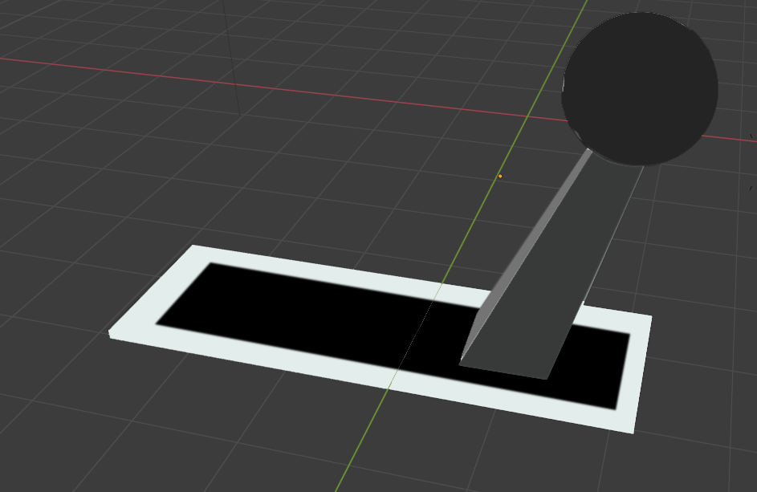
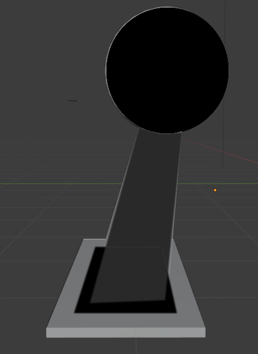
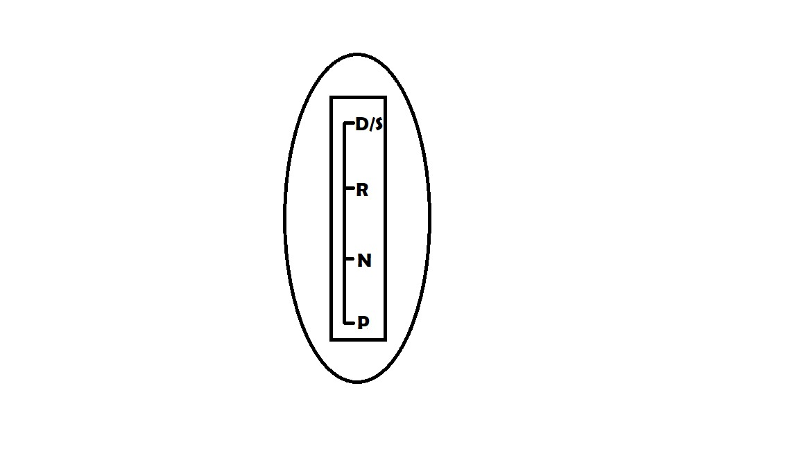

# HCI Task 1 Report

## The Death of Anton Yelcin

### Why the Incident Happen?
Pada musim panas tahun 2016, seorang bintang Star Trek bernama Anton Yelchin ditemukan meninggal ditabrak mobilnya sendiri yang meluncur mundur di jalanan rumahnya yang miring dan mengimpit tubuh Yelchin ke tiang kotak pos dan pagar rumah. Asisten Kepala Koroner Ed Winter dari kantor koroner Los Angeles County mengatakan kepada ***People Magazine***, Yelchin meninggal karena *"blunt traumatic asphyxia"* yang tidak disengaja. Blunt traumatic asphyxia adalah kondisi medis ketika pasien kesulitan bernafas akibat tekanan di bagian dada.  Yelchin mengendarai Jeep Grand Cherokee 2015, salah satu mobil yang ditarik kembali oleh Fiat Chrysler. Penyebabnya? Desain yang buruk.

Lebih spesifiknya, karena persneling yang tidak intuitif, mengakibatkan pengemudi berpikir kalau ia sudah memarkirkan mobil padahal sebenarnya belum. Kalau sang pengemudi keluar dari mobil ketika mobil tidak dalam keadaan diparkir, maka mobil seberat 5000 pounds tersebut dapat meluncur dan menghancurkan semua benda (atau manusia dan hewan) yang berada di jalurnya. Umumnya, persneling bila digerakkan ke posisi gigi tertentu akan tetap diam di posisi tersebut, sehingga pengemudi dapat melihat dan mengetahui posisi gigi mobil pada saat itu. Namun, “persneling monostabil” pada beberapa mobil buatan Chrysler akan kembali ke posisi semula setelah mengganti posisi gigi mobil, sehingga pengemudi harus benar-benar mengingat posisi terakhir persneling. 

Desain persneling yang buruk ini “tidak intuitif dan memberikan umpan balik taktil (berkaitan dengan rabaan, KBBI) dan visual yang buruk kepada pengemudi yang mengakibatkan meningkatnya potensi posisi gigi yang tidak diinginkan” tulis  *National Highway Traffic Safety Administration* dalam sebuah laporan yang dirilis pada awal tahun 2017. Lalu, *National Highway Traffic Safety Administration* telah menyampaikan keluhan pengemudi tentang persneling ke Fiat Chrysler Agustus lalu. Pada saat penarikan mobil diumumkan pada bulan April, pembuat mobil telah menerima 700 keluhan terkait dengan masalah persneling, termasuk lebih dari 200 kecelakaan dan setidaknya 41 cedera. Sebagian besar keluhan pengemudi yaitu pengemudi mengira kalau mobil yang ia kendarai telah ia parkir, namun ternyata mobil tersebut belum diparkir sehingga ketika ia keluar dari mobil, mobil tersebut meluncur menjauh. Sejauh ini, hanya kematian Yelchin yang diketahui diakibatkan oleh desain persneling yang buruk.

### Design Error
Kecelakaan ini disebabkan kesalahan desain pada model persneling dari mobil Jeep Grand Cherokee 2015. Kesalahan pertamanya yaitu pada saat mengganti *gear*(gigi), batang persneling kembali ke posisi awal sehingga pengemudi harus melihat huruf pada persneling atau *dashboard* untuk mengetahui posisi *gear* saat itu. Hal ini tentu saja sangat mengganggu konstentrasi pengemudi saat berkendara. Kesalahan yang kedua yaitu pada saat mengganti posisi *gear* tidak ada sesuatu yang menandakan bahwa posisi *gear* sudah berganti. Tidak seperti model persneling lama dimana terdapat gap pada setiap posisi *gear*-nya, pada model ini gap tersebut tidak ada sehingga sekali lagi pengemudi harus melihat huruf pada persneling atau *dashboard* yang tentunya mengganggu konsentrasi.

### Improvisasi Desain

Penjelasan :
Kami membuat tuas pegangan supir berbentuk bola dikarenakan agar lebih mudah digenggam daripada yang berbentuk meyerupai balok diatas yang tidak terbiasa di untuk digenggam meskipun kecil. Kemudian kami melakukan perombakan pada rail atau tempat perpindahan gigi dan batang tuas menjadi sedikit lebih panjang agar lebih terlihat letak posisi tuas sedang masuk mode gigi yang mana. 

    

Penjelasan:
Selanjutnya kami sedikit menambahkan gerakan tambahan kepada tuas tersebut yaitu suatu pegas di kiri yang mendorong tuas ke kanan sehingga menimbulkan efek seperti slide yang akan membantu supir lebih meyakinkan bahwa keadaan mobil tersebut sudah masuk mode yang diinginkan.

    

Penjelasan:
Desain shifter kami desain seperti diatas agar memberikan representasi bahwa saat mobil melaju atau dalam mode drive maka supir tersebut harus mendorong perseneling tersebut ke depan, dan saat mobil sedang dalam posisi parking maka supir tersebut harus menarik tuas perseneling ke belakang seperti pada mobil dengan perseneling manual menarik rem tangan.